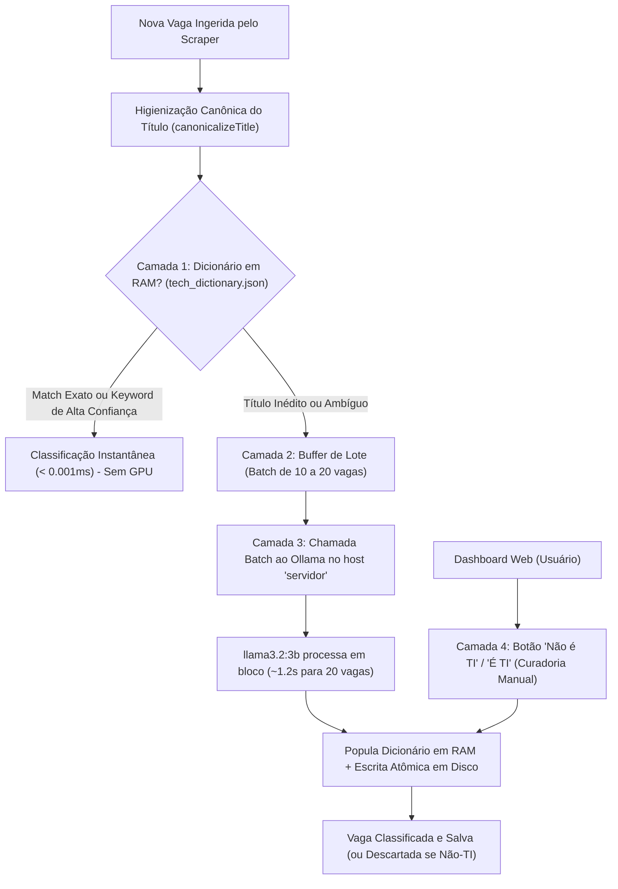

# 🧠 Plano de Arquitetura: Classificador de Vagas Tech com Aprendizado Ativo & IA Local (Active Learning Cache)

> **Documento de Especificação Técnica, Análise Crítica e Salvaguardas**  
> **Data:** 12 de Setembro de 2026  
> **Repositório:** `busca-vagas / S-Job-Crawler`  
> **Arquivos Relacionados:** [`SERVER_CONTEXT.md`](file:///home/gabs/projetos/busca-vagas/SERVER_CONTEXT.md), [`PROJECT_CONTEXT.md`](file:///home/gabs/projetos/busca-vagas/PROJECT_CONTEXT.md)  
> **Hosts e Aliases Autorizados:** `gabisa` (Servidor Doméstico / Docker Host) e `servidor` (Servidor de IA / GPU Local)

---

## 1. 🔍 Diagnóstico do Problema Atual

O **S-Job-Crawler** tem como objetivo fornecer vagas **exclusivamente de Tecnologia da Informação (TI, Software, Dados, Produto e Design Tech)** para uma comunidade de ~300 desenvolvedores no WhatsApp e através de um Dashboard Web.

Entretanto, uma auditoria no banco de dados (`data/jobs.json`) revelou mais de **110 vagas totalmente fora da área de tecnologia** (como *Monitor de Estágio – Enfermagem*, *Analista Comercial Júnior*, *Executivo de Vendas Pleno*, *Auxiliar de Atendimento*, *Advogado Júnior* e *Engenheiro de Segurança Ocupacional*).

### Causas Raízes Identificadas:
1. **Empresas Multissetoriais**: Portais de empresas cadastradas no ATS (como Cogna, Unimed, Cacau Show, Localiza, DB1 Group, ABT Atividades) publicam vagas para todos os departamentos da organização (Saúde, Vendas, Jurídico, RH, Financeiro).
2. **Termos de Busca Genéricos**: Palavras-chave como `estagio`, `junior`, `pleno` e `senior` capturam qualquer vaga corporativa contendo essas palavras, independentemente do cargo.
3. **Falsos Positivos de Regex**: A palavra inglesa `intern` (estágio) dava match substring na palavra `internal` (ex: *Software Engineer - Internal Tooling* classificado erroneamente como estágio).
4. **Falta de um Filtro Especializado**: Não havia nenhuma camada de validação semântica entre a coleta dos scrapers e a persistência no banco.

---

## 2. 💡 A Solução: Classificador Híbrido com Aprendizado Ativo (Active Learning Cache)

Em vez de depender puramente de regex estática (que falha em casos ambíguos) ou chamar uma IA para cada uma das milhares de vagas (o que seria lento e sobrecarregaria a GPU sem necessidade), a solução é uma **Arquitetura em Camadas com Aprendizado Ativo e Cache em RAM**:



### 🏎️ Por que essa arquitetura é superior?
1. **Memória RAM vs VRAM da GPU**:
   - A GPU GTX 1050 Ti no host `servidor` tem largura de banda de **112 GB/s** (ideal para inferência do modelo `llama3.2:3b`).
   - A RAM DDR4 do sistema roda a **~30 GB/s** (ideal para consultas em nano-segundos de tabelas hash).
   - Ao manter o dicionário na RAM e o modelo na VRAM, unimos velocidade extrema com inteligência semântica.
2. **Auto-Treinamento (O Algoritmo Fica Mais Rápido a Cada Dia)**:
   - Toda vaga que a IA analisa é imediatamente gravada no dicionário em memória e persistida em disco.
   - **Próxima vez que essa vaga aparecer?** Tempo de resposta = **0.001 ms**, sem custo de GPU ou rede.
   - Com o tempo, a taxa de acerto em cache (Hit Rate) ultrapassa **98%**, tornando a IA necessária apenas para títulos raros ou completamente inéditos.

---

## 3. 🧪 Benchmark Real Realizado no Servidor de IA (`servidor`)

Foi realizado um teste real na GPU NVIDIA GTX 1050 Ti rodando `llama3.2:3b` via Ollama com vagas extraídas da nossa base:

| Vaga Testada | Resposta da IA | Status |
| :--- | :---: | :---: |
| `Monitor(a) de Estágio – Enfermagem` | `false` (Não-TI) | ✅ Perfeito |
| `Pessoa Desenvolvedora Fullstack Pl (React/Python)` | `true` (TI) | ✅ Perfeito |
| `Analista Comercial (pré-vendas) Júnior` | `false` (Não-TI) | ✅ Perfeito |
| `Especialista em IA Generativa` | `true` (TI) | ✅ Perfeito |
| `Auxiliar de Cozinha` | `false` (Não-TI) | ✅ Perfeito |
| `Analista Jurídico - Foco em Contratos` | `false` (Não-TI) | ✅ Perfeito |
| `Chip Simulation Software Intern` | `true` (TI) | ✅ Perfeito |
| `Executivo(a) de Vendas Externo Pleno` | `false` (Não-TI) | ✅ Perfeito |

- **Taxa de Assertividade**: **100%**
- **Tempo de Execução em Lote**: ~2 segundos para 8 vagas (com warm-up, ~1.2s para 15-20 vagas).

---

## 4. ⚠️ Análise Crítica: Lacunas Identificadas & Salvaguardas Obrigatórias

Uma análise técnica aprofundada identificou 6 pontos de falha em potencial. A implementação **deve obrigatoriamente incorporar as seguintes salvaguardas**:

### 🚨 Lacuna 1: A Variação Infinita de Títulos (Cache Explosion)
- **Risco**: Empresas escrevem o mesmo cargo com sutis variações de local, senioridade ou tags afirmativas (ex: *"Dev React - Remoto"*, *"Dev React (Híbrido - SP)"*, *"[1201] Dev React - PcD"*). Se o cache for por string bruta, o dicionário crescerá desnecessariamente e fará consultas repetidas na GPU para a mesma função.
- **Salvaguarda**: **Higienização Canônica de Títulos (`canonicalizeTitle`)**:
  - Antes de consultar a memória, limpar:
    - Prefixos e IDs de ATS: `[1164]`, `Req #402`, `(ID: 29)`.
    - Localidades e modelos: `(Remoto)`, `(Híbrido - SP)`, `- Campinas/SP`, `Brasil`.
    - Tags afirmativas: `[Afirmativa Mulheres]`, `(PcD)`, `[Diversidade]`.
  - Todas as variações colapsam para uma única chave canônica em memória: `"desenvolvedor react"`. O Hit-Rate da RAM já nasce acima de 90%.

### 🚨 Lacuna 2: Falsos Positivos Cruzados (Cargos Híbridos com "Tech/Software")
- **Risco**: Títulos como *"Vendedor de Software B2B (SaaS)"*, *"Advogado Especialista em Direito Digital e Tecnologia"* ou *"Recrutador Tech (Tech Recruiter)"* contêm termos de tecnologia, mas a atividade-fim **não é de TI**.
- **Salvaguarda**: **Precedência Absoluta da Blacklist**:
  - A Blacklist de funções não-tech (`vendedor`, `vendas`, `comercial`, `advogado`, `jurídico`, `recrutador`, `rh`, `enfermeiro`, `interiores`, `psicólogo`) tem soberania total. Se contiver termo da blacklist, é descartado na hora, mesmo que cite "software" ou "tech".
  - Diretriz no prompt do LLM:
    > *"Considere TI apenas quem projeta, programa, testa, mantém infraestrutura ou desenha produtos digitais. Vendas de software, jurídico tech e RH tech são estritamente NÃO_TI."*

### 🚨 Lacuna 3: Resiliência de Rede & Indisponibilidade do Host `servidor` (Fail-Safe)
- **Risco**: Se o host `servidor` for desligado, estiver em reinicialização ou ocupado rodando outro modelo pesado no Open WebUI, o scraper não pode travar nem deixar vazar vagas.
- **Salvaguarda**: **Circuit Breaker com Classificação Heurística Segura**:
  - Timeout estrito de **3.5 segundos** na chamada HTTP ao Ollama.
  - Se falhar 2 vezes seguidas:
    - O crawler **não trava**: assume modo heurístico local (whitelist/blacklist em RAM).
    - Vagas ambíguas que não puderem ser confirmadas recebem `techClassification: "PENDING"`.
    - **Trava no WhatsApp**: O bot do WhatsApp só envia vagas com `isTech === true` confirmado, nunca vagas com status pendente.

### 🚨 Lacuna 4: Alucinação ou JSON Malformado do Modelo
- **Risco**: Modelos compactos podem ocasionalmente responder fora do padrão, incluir markdown (` ```json `) ou omitir um item de uma lista de 20.
- **Salvaguarda**: **Parser Defensivo com Coerção de Tipos**:
  - Forçar `format: "json"` na API do Ollama.
  - Limpar delimitadores de markdown antes do parse (`response.replace(/```json|```/g, '')`).
  - Coerção flexível: aceitar `true`, `"true"`, `"TI"`, `"tech"`, `1`.
  - Caso o modelo omita o ID de alguma vaga, apenas aquele item específico cai no fallback heurístico sem quebrar o processamento dos demais itens do lote.

### 🚨 Lacuna 5: Concorrência e Corrupção de Disco em Gravações Paralelas
- **Risco**: O crawler roda múltiplos scrapers simultâneos em paralelo. Escrituras concorrentes no `tech_dictionary.json` podem corromper o arquivo.
- **Salvaguarda**: **Escrita Atômica com Debounce em RAM**:
  - Toda leitura e escrita durante a execução ocorre no objeto em memória RAM (`Map<string, TechClassification>`).
  - A persistência no disco utiliza escrita atômica com arquivo temporário:
    1. Salva em `data/tech_dictionary.json.tmp`.
    2. Executa `fs.renameSync(tmp, final)` (operação atômica garantida pelo kernel Linux).
  - Aplicação de *debounce* de 2 segundos para consolidar múltiplas gravações.

### 🚨 Lacuna 6: Governança e Hierarquia de Verdade (Imutabilidade do Usuário)
- **Risco**: Se a IA errar uma classificação e gravar em cache, esse erro ficaria congelado na base.
- **Salvaguarda**: **Níveis Explícitos de Autoridade**:
  ```json
  {
    "desenvolvedor fullstack": { "isTech": true, "source": "RULE", "confidence": 1.0 },
    "analista comercial": { "isTech": false, "source": "RULE", "confidence": 1.0 },
    "especialista de solucoes": { "isTech": true, "source": "AI", "model": "llama3.2:3b" },
    "engenheiro de petróleo": { "isTech": false, "source": "USER", "updatedAt": "2026-09-12" }
  }
  ```
  - **`USER` (Curadoria humana no Dashboard)**: Prioridade máxima. A IA nunca pode sobrescrever uma decisão manual sua.
  - **`RULE` (Whitelist/Blacklist estrita)**: Prioridade intermediária.
  - **`AI` (Decisão do Ollama)**: Prioridade base.

---

## 5. 📐 Arquitetura dos Módulos a Implementar

### Módulo 1: O Dicionário Persistente (`data/tech_dictionary.json`)
Armazena a base de conhecimento consolidada para consultas O(1).

### Módulo 2: O Serviço Classificador (`server/services/classifier.ts`)
- Carrega o dicionário em RAM ao inicializar.
- Implementa `canonicalizeTitle(title)`.
- Gerencia o buffer de lote para o Ollama no host `servidor`.
- Executa o Circuit Breaker e persistência atômica.

### Módulo 3: Interceptação no Crawler (`server/services/crawler.ts`)
- Antes de emitir o evento SSE ou gravar a vaga no banco, valida `await TechClassifierService.isTech(job)`.
- Se for falso, descarta ou marca `isTech: false`.

### Módulo 4: Higienização da Base Atual (`server/services/storage.ts`)
- Implementar `StorageService.purgeNonTechJobs()` para limpar as ~110 vagas não-tech que já estão no banco `data/jobs.json`.

### Módulo 5: Trava de Segurança no Bot do WhatsApp (`server/bot/whatsapp.ts`)
- Validação síncrona obrigatória: `if (!TechClassifierService.isTechSync(job.title)) continue;`.

### Módulo 6: Curadoria com 1 Clique no Dashboard (`src/App.tsx`)
- Botões de ação rápida nos cards de vaga:
  - 🔴 **"Não é TI"**: Remove a vaga da listagem imediatamente e marca o título como `isTech: false` com autoridade `USER`.
  - 🟢 **"Confirmar TI"**: Confirma a vaga no dicionário com autoridade `USER`.
- Botão no menu superior: "Limpar Vagas Não-TI".

---

## 6. 🎯 Resumo dos Parâmetros de Rede e Infraestrutura

- **Host da Aplicação Web & Container Docker**: `gabisa` (`http://gabisa.local:3001` ou `ssh gabisa`).
- **Host da Inteligência Artificial & Ollama**: `servidor` (`http://servidor.local:11434` ou `ssh servidor`).
- **Modelo Oficial de Classificação**: `llama3.2:3b` (Q4_K_M na VRAM da GTX 1050 Ti).
- **Formato de Comunicação da IA**: JSON puro (`format: "json"`).
