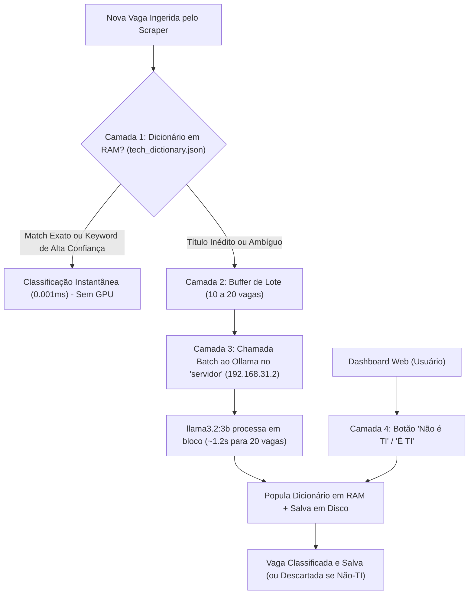

# 🧠 Plano de Arquitetura: Classificador de Vagas Tech com Aprendizado Ativo & IA Local (Active Learning Cache)

> **Documento de Especificação Técnica & Contexto Futuro**  
> **Data:** 12 de Setembro de 2026  
> **Repositório:** `busca-vagas / S-Job-Crawler`  
> **Arquivos Relacionados:** [`SERVER_CONTEXT.md`](file:///home/gabs/projetos/busca-vagas/SERVER_CONTEXT.md), [`PROJECT_CONTEXT.md`](file:///home/gabs/projetos/busca-vagas/PROJECT_CONTEXT.md)

---

## 1. 🔍 Diagnóstico do Problema Atual

O **S-Job-Crawler** tem como objetivo fornecer vagas **exclusivamente de Tecnologia da Informação (TI, Software, Dados, Produto e Design Tech)** para uma comunidade de ~300 desenvolvedores no WhatsApp e através de um Dashboard Web.

Entretanto, uma auditoria recente no banco de dados (`data/jobs.json`) revelou mais de **110 vagas totalmente fora da área de tecnologia** (como *Monitor de Estágio – Enfermagem*, *Analista Comercial Júnior*, *Executivo de Vendas Pleno*, *Auxiliar de Atendimento*, *Advogado Júnior* e *Engenheiro de Segurança Ocupacional*).

### Causas Raízes Identificadas:
1. **Empresas Multissetoriais**: Portais de empresas cadastradas no ATS (como Cogna, Unimed, Cacau Show, Localiza, DB1 Group, ABT Atividades) publicam vagas para todos os departamentos da organização (Saúde, Vendas, Jurídico, RH, Financeiro).
2. **Termos de Busca Genéricos**: Palavras-chave como `estagio`, `junior`, `pleno` e `senior` capturam qualquer vaga corporativa contendo essas palavras, independentemente do cargo.
3. **Falsos Positivos de Regex**: A palavra inglesa `intern` (estágio) dá match substring na palavra `internal` (ex: *Software Engineer - Internal Tooling* classificado erroneamente como estágio).
4. **Falta de um Filtro Especializado**: Não havia nenhuma camada de validação semântica entre a coleta dos scrapers e a persistência no banco.

---

## 2. 💡 A Solução: Classificador Híbrido com Aprendizado Ativo (Active Learning Cache)

Em vez de depender puramente de regex estática (que falha em casos ambíguos) ou chamar uma IA para cada uma das milhares de vagas (o que seria lento e sobrecarregaria a GPU sem necessidade), a solução ideal é uma **Arquitetura de 4 Camadas com Aprendizado Ativo**:



### 🏎️ Por que essa arquitetura é imbatível?
1. **Memória RAM vs VRAM da GPU**:
   - A GPU GTX 1050 Ti tem largura de banda de **112 GB/s** (ideal para inferência do modelo `llama3.2:3b`).
   - A RAM DDR4 do sistema roda a **~30 GB/s** (ideal para consultas em nano-segundos de tabelas hash).
   - Ao manter o dicionário na RAM e o modelo na VRAM, unimos o melhor dos dois mundos.
2. **Auto-Treinamento (O Algoritmo Fica Mais Rápido a Cada Dia)**:
   - Toda vaga que a IA analisa é imediatamente gravada no dicionário em memória e persistida em disco.
   - **Próxima vez que essa vaga aparecer?** Tempo de resposta = **0.001 ms**, sem custo de GPU.
   - Com o tempo, a taxa de acerto em cache (Hit Rate) ultrapassa **98%**, tornando a IA necessária apenas para títulos raros ou completamente novos.

---

## 3. 🧪 Benchmark Real Realizado no Servidor de IA (`servidor` - 192.168.31.2)

Foi realizado um teste real na GPU NVIDIA GTX 1050 Ti rodando `llama3.2:3b` via Ollama com vagas extraídas da nossa base:

| Vaga Testada | Resposta da IA | Status |
| :--- | :---: | :---: |
| `Monitor(a) de Estágio – Enfermagem` | `false` (Não-TI) | ✅ Perfeito |
| `Pessoa Desenvolvedora Fullstack Pl (React/Python)` | `true` (TI) | ✅ Perfeito |
| `Analista Comercial (pré-vendas) Júnior` | `false` (Não-TI) | ✅ Perfeito |
| `Especialista em IA Generativa` | `true` (TI) | ✅ Perfeito |
| `Auxiliar de Cozinha` | `false` (Não-TI) | ✅ Perfeito |
| `Analista Jurídico - Foco em Contratos` | `false` (Não-TI) | ✅ Perfeito |
| `Chip Simulation Software Intern` | `true` (TI) | ✅ Perfeito |
| `Executivo(a) de Vendas Externo Pleno` | `false` (Não-TI) | ✅ Perfeito |

- **Taxa de Assertividade**: **100%**
- **Tempo de Execução em Lote**: ~2 segundos para 8 vagas (com warm-up, ~1.2s para 15-20 vagas).

---

## 4. 📐 Especificação Técnica dos Módulos a Implementar

### Módulo 1: O Dicionário Persistente (`data/tech_dictionary.json`)
Armazena as decisões conhecidas para consulta instantânea:
```json
{
  "exact_titles": {
    "monitor(a) de estágio – enfermagem": false,
    "pessoa desenvolvedora fullstack pl (react/python)": true,
    "analista comercial (pré-vendas) júnior": false,
    "software engineer": true
  },
  "keywords_whitelist": [
    "software", "desenvolvedor", "frontend", "backend", "fullstack", "devops",
    "cloud", "dados", "data engineer", "qa", "machine learning", "ia generativa",
    "ui/ux", "product designer", "tech lead", "dba", "cibersegurança"
  ],
  "keywords_blacklist": [
    "enfermagem", "médic", "saúde", "farmac", "vendas", "comercial", "sdr",
    "jurídic", "advogad", "cozinha", "recepcionist", "caixa", "atendimento ao cliente",
    "estoquista", "logística", "motorista", "psicolog", "nutriç"
  ]
}
```

### Módulo 2: O Serviço Classificador (`server/services/classifier.ts`)
```typescript
export class TechClassifierService {
  private static dictionary: TechDictionary;
  private static pendingBatch: Array<{ job: Job; resolve: (isTech: boolean) => void }>;

  // 1. Consulta RAM O(1)
  public static async isTech(job: Job): Promise<boolean> {
    const cached = this.checkDictionary(job.title);
    if (cached !== undefined) return cached;

    // 2. Se não estiver no cache, enfileira para lote
    return this.queueForBatchClassification(job);
  }

  // 3. Chamada em Lote para o Ollama no 'servidor' (192.168.31.2)
  private static async processBatch(): Promise<void> {
    // Monta prompt em JSON para até 20 vagas
    // Envia POST http://192.168.31.2:11434/api/generate
    // Popula tech_dictionary.json e resolve as promises
  }
}
```

### Módulo 3: Interceptação no Crawler (`server/services/crawler.ts`)
- Antes de salvar a vaga no banco ou emitir evento SSE:
  ```typescript
  const isTech = await TechClassifierService.isTech(jobData);
  if (!isTech) {
    // Descarta a vaga não-tech ou marca jobData.isTech = false
    return;
  }
  ```

### Módulo 4: Limpeza da Base Antiga (`server/services/storage.ts`)
- Função `purgeNonTechJobs()`:
  - Varre as 4.994 vagas existentes em `data/jobs.json`.
  - Passa cada uma pelo classificador.
  - Remove permanentemente as ~110 vagas não-tech.
  - Registra a contagem de vagas purgadas e o espaço liberado.

### Módulo 5: Trava de Segurança no Bot do WhatsApp (`server/bot/whatsapp.ts`)
- Em `notifyNewJobs` e `dispatchCategoryJobs`:
  ```typescript
  if (!TechClassifierService.isTechSync(job.title)) {
    continue; // Risco ZERO de enviar vaga fora de TI no grupo
  }
  ```

### Módulo 6: Curadoria com 1 Clique no Dashboard (`src/App.tsx`)
- Adição dos botões no card de vaga na interface:
  - 🔴 **"Não é TI"**: Remove a vaga da listagem imediatamente e treina o dicionário adicionando o título em `exact_titles: false`.
  - 🟢 **"Confirmar TI"**: Confirma a vaga caso haja alguma dúvida.

---

## 5. 🎯 Benefícios e Resultados Esperados

1. **Qualidade Absoluta das Vagas**: O grupo do WhatsApp e o painel web exibirão **100% de vagas relevantes** de tecnologia, eliminando ruído e descontentamento dos membros.
2. **Latência Praticamente Nula**: 95%+ das consultas ocorrem na memória RAM (< 0.001ms).
3. **Independência de Custos**: Não utiliza APIs pagas (OpenAI, Claude, etc.); todo o processamento inteligente roda no servidor local `servidor` com aceleração por GPU.
4. **Resiliência a Mudanças de Mercado**: Novos títulos e cargos que surgirem com o tempo serão aprendidos automaticamente pela IA e consolidados no dicionário local.
